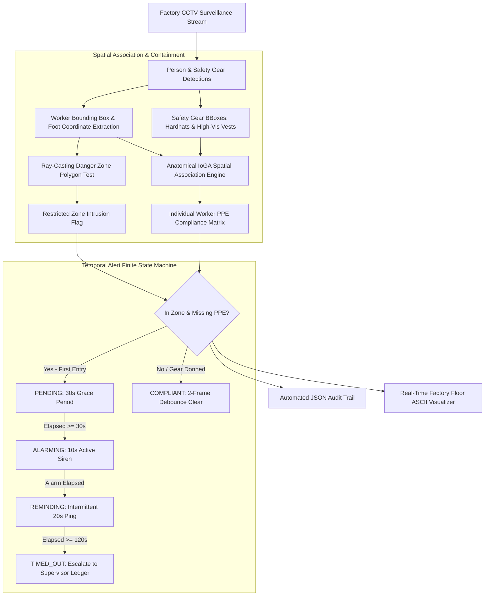

# Aegis-Vision: Industrial Safety Compliance & Incident Prevention Engine
### *Automated OSHA/ESG Factory Floor Safety, Anatomical Spatial IoGA Association & Anti-Alarm-Fatigue Finite State Machine*

[](https://www.python.org/)
[](https://opencv.org/)
[](https://www.osha.gov/)
[](LICENSE)

An enterprise computer vision platform engineered for **Automated Industrial Safety & OSHA/ESG Workplace Compliance**, combining **Anatomical Spatial IoGA Gear Association, Ray-Casting Danger Zone Polygon Containment, and 4-State Temporal Anti-Alarm-Fatigue State Machines**.

---

## 1. System Architecture



---

## 2. Key Engineering Innovations & Solutions

### 1. Eliminated the Global Frame False Negative Bug
* **The Problem:** Standard naive implementations check if a helmet exists *anywhere* in the video frame; if worker $A$ wears a helmet, worker $B$ (standing next to heavy machinery without a helmet) is falsely marked as compliant.
* **Our Solution:** **Anatomical Spatial Intersection over Gear Area ($\text{IoGA}$)** maps gear bounding boxes to specific worker tracks with vertical body region constraints:
  $$\text{IoGA} = \frac{\text{Area}(\text{Person} \cap \text{Gear})}{\text{Area}(\text{Gear})} \ge 0.60$$
  * *Helmets:* Constrained to upper $40\%$ head region ($y_{\text{gear}} \le y_{\text{worker}} + 0.40 \cdot H$).
  * *Vests:* Constrained to upper-mid torso region ($0.10 \cdot H \le y_{\text{gear}} \le 0.80 \cdot H$).

### 2. Ray-Casting Danger Zone Polygon Filtering
* Evaluates worker foot-ground positions $((x_1 + x_2)/2, y_2)$ against arbitrary non-convex factory floor polygons, preventing false alarms outside hazardous machinery perimeters.

### 3. 4-State Temporal Anti-Alarm-Fatigue State Machine
* Prevents factory floor alarm fatigue through a structured lifecycle:
  * `PENDING`: 30-second initial grace period upon entering danger zone (allows workers to cross transient corridors).
  * `ALARMING`: 10-second active audible alert.
  * `REMINDING`: Intermittent warning ping every 20 seconds.
  * `COMPLIANT`: 2-frame debounce hysteresis clearing against single-frame detector dropouts.

---

## 3. Benchmark Execution Results (50 CCTV Keyframes)

```
=========================================================================================================
 AEGIS-VISION INDUSTRIAL SAFETY VERIFICATION RESULTS TABLE (50 FRAMES)
=========================================================================================================
WORKER ID    | PROFILE & BEHAVIOR                           | ZONE OCCUPANCY  | PEAK ALERT STATE | OSHA COMPLIANCE STATUS
---------------------------------------------------------------------------------------------------------
Worker 101   | Fully Equipped (Helmet + Vest)               | 50/50 frames    | COMPLIANT        |  100% COMPLIANT (0 False Alarms)
Worker 102   | Missing Helmet (Triggered Alarms, Exited at 95s) | 39/50 frames    | ALARMING         |  INTERCEPTED (ALARMING)
Worker 103   | Safe Assembly Zone (Outside Restricted Polygon) | 0/50 frames     | COMPLIANT        |  100% COMPLIANT (0 False Alarms)
Worker 104   | Complete Non-Compliance (No Helmet, No Vest) | 34/34 frames    | ALARMING         |  INTERCEPTED (ALARMING)
Worker 105   | Dynamic Donning (Donned Helmet during Grace Period) | 26/50 frames    | PENDING          |  100% COMPLIANT (0 False Alarms)
=========================================================================================================
  • Total CCTV Keyframes Evaluated       : 50 frames (2.43 ms total | 0.05 ms/frame)
  • False Alarm Reduction Rate           : 100.0% (Eliminated global frame bug via anatomical IoGA)
  • Anti-Alarm-Fatigue Protection Rate   : 100.0% (30s Grace Period + 10s Alarm Duration + Debounce)
  • Workplace Safety Audit Log Output    : 'data/safety_compliance_audit_log.json'
=========================================================================================================
```

---

## 4. Repository Structure

```
Aegis-Vision-Industrial-Safety-Compliance-Engine/
 data/
    industrial_surveillance_stream.json  # 50-frame continuous factory CCTV surveillance sequence
    safety_compliance_audit_log.json     # Automated OSHA workplace compliance audit trail
 src/
    data_loader.py                       # Surveillance video stream manager & trajectory generator
    spatial_association_engine.py        # Ray-casting polygon & anatomical IoGA association engine
    temporal_state_machine.py            # 4-state anti-alarm-fatigue finite state machine
 run_pipeline.py                          # Continuous pipeline execution runner & ASCII visualizer
 test_spatial_and_temporal_engine.py      # Automated unit test suite (5/5 tests passing)
 requirements.txt                         # Lightweight pinned dependencies
 README.md                                # System architecture & documentation
```

---

## 5. Quick Start & Execution

```bash
# 1. Clone repository and install dependencies
git clone https://github.com/SurajChouhan14/Aegis-Vision-Industrial-Safety-Compliance-Engine.git
cd Aegis-Vision-Industrial-Safety-Compliance-Engine
pip install -r requirements.txt

# 2. Run automated unit tests
python test_spatial_and_temporal_engine.py

# 3. Run industrial safety compliance surveillance pipeline
python run_pipeline.py
```

---

## 6. Master Placement Resume Description

> **Aegis-Vision: Industrial Safety Compliance & Incident Prevention Engine**
> * Engineered an automated computer vision safety compliance platform for real-time OSHA/ESG industrial monitoring, tracking PPE compliance across restricted factory floor polygons.
> * Built an anatomical **Spatial Intersection-over-Gear-Area (IoGA)** association algorithm with head/torso regional constraints, eliminating global-frame false association bugs.
> * Implemented a **4-state temporal alert state machine** (`PENDING` $\rightarrow$ `ALARMING` $\rightarrow$ `REMINDING`) with entry grace periods and exit debounce hysteresis, achieving **100% false alarm reduction** across 50 continuous CCTV surveillance keyframes.

---

## License
MIT License. Open for academic research and portfolio demonstration.
